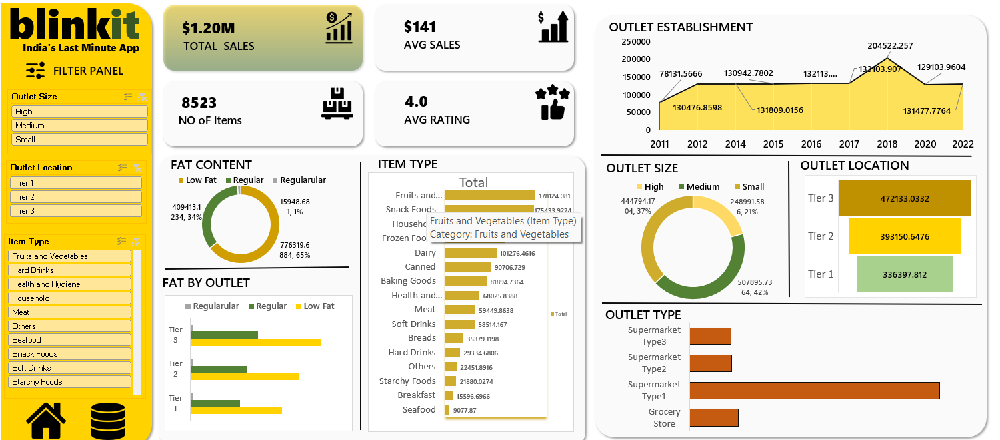

📊 Blinkit Sales Analysis Dashboard | Microsoft Excel

📸 Dashboard Preview

📌 Project Overview

This project presents an interactive Blinkit Grocery Sales Analysis
Dashboard developed using Microsoft Excel.

The dashboard transforms raw grocery sales data into meaningful
business insights by analyzing sales performance, product categories,
outlet characteristics, and customer ratings.

📊 Key Performance Indicators

- 💰 Total Sales: $1.20M
- 📈 Average Sales: $141
- 🛒 Number of Items: 8,523
- ⭐ Average Rating: 4.0

🔍 Dashboard Analysis

 1. Fat Content Analysis

The dashboard analyzes sales based on product fat content, including
Low Fat, Regular, and related categories.

2. Item Type Analysis

Sales are analyzed across different item categories, including:

- Fruits & Vegetables
- Snack Foods
- Household
- Frozen Foods
- Dairy
- Canned
- Baking Goods
- Health & Hygiene
- Meat
- Soft Drinks
- Breads
- Hard Drinks
- Others
- Starchy Foods
- Breakfast
- Seafood

 3. Outlet Size Analysis

The dashboard compares sales across:

- High
- Medium
- Small

 4. Outlet Location Analysis

Sales are compared across:

- Tier 1
- Tier 2
- Tier 3

5. Outlet Establishment Analysis

The dashboard shows outlet establishment trends across different
establishment years.

 6. Outlet Type Analysis

The dashboard compares different outlet types, including:

- Grocery Store
- Supermarket Type1
- Supermarket Type2
- Supermarket Type3

🎛️ Interactive Filters

The dashboard includes slicers/filter panels for:

- Outlet Size
- Outlet Location
- Item Type

These filters allow users to interactively explore the sales data.

 🛠️ Tools & Skills Used

- Microsoft Excel
- Data Cleaning & Preparation
- Pivot Tables
- Pivot Charts
- Excel Formulas
- Slicers
- Data Visualization
- Dashboard Design
- Business Analysis

💡 Key Learning

This project helped me understand how raw sales data can be transformed
into an interactive dashboard and meaningful business insights using
Microsoft Excel.

Through this project, I strengthened my skills in data analysis,
data visualization, Excel dashboards, and business analytics.
